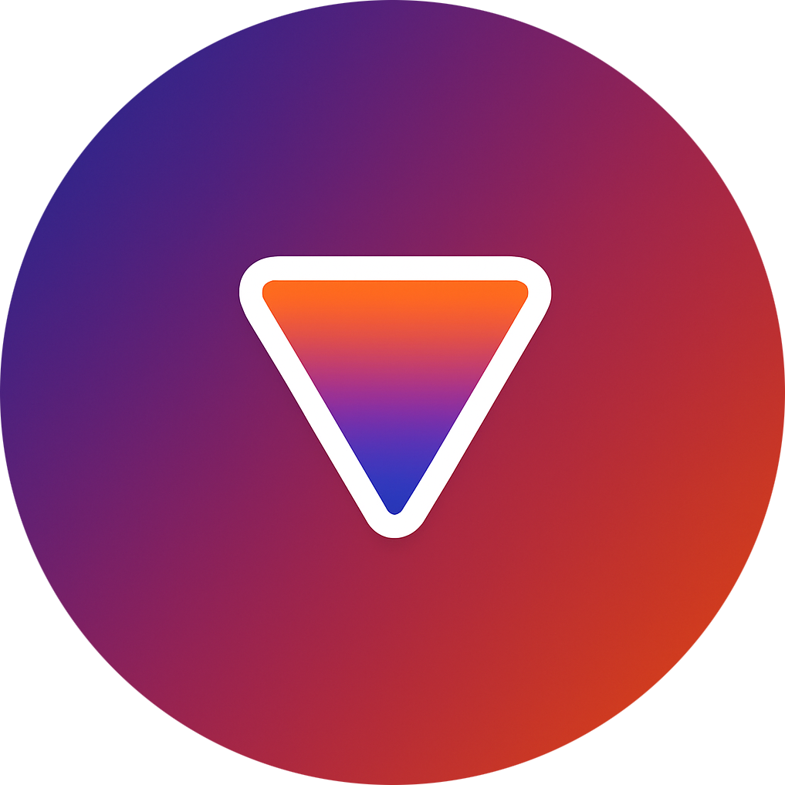

  <picture>
    <source
      width="256px"
      media="(prefers-color-scheme: dark)"
      srcset="assets/icons/icon-circle.png"
    >
    
  </picture>

# 💊 Universal ReVanced Manager

Application for using ReVanced, Morphe and AmpleReVanced all in a single app on Android.

  
  &nbsp;
  
  &nbsp;
  
  &nbsp;
  
  &nbsp;
  

## 💪 Unique Features

Universal ReVanced Manager includes powerful features that the official ReVanced Manager does not:

<strong>Patch Bundles & Customization</strong>

<ul>
  <li><strong>Third-party patch support:</strong> Import any third-party API v4 patch bundle you want (including popular ones like inotia00's or anddea's), which the official ReVanced Manager does not support.</li>
  <li><strong>Custom bundle names:</strong> Set a custom display name for any imported patch bundle so you can tell them apart at a glance.</li>
  <li><strong>Smarter patch selection:</strong>
    <ul>
      <li>Global deselect all button</li>
      <li>Per-bundle deselect all button</li>
      <li>Per-bundle select all button</li>
      <li>Global select all button</li>
      <li>Patch profiles button to save patch selections and option states per app</li>
      <li>Patch profiles can store a persistent APK path for one-tap patching</li>
      <li>Patch confirmation screen showing selected bundles, patches, and sub-options</li>
      <li>Export all patch selections at once</li>
      <li>Latest patch bundle changelogs shown in bundle info</li>
      <li>Undo and redo buttons</li>
    </ul>
  </li>
  <li><strong>Bundle recommendation picker:</strong> Choose per-bundle suggested versions or override with any other supported version.</li>
  <li><strong>Suggestion toggle on Select-App:</strong> Bundle suggestions are grouped behind a toggle with inline dialogs to view additional supported versions.</li>
  <li><strong>Official bundle management:</strong> Delete the Official ReVanced patch bundle from the Patch Bundles tab and restore it from Advanced settings.</li>
  <li><strong>Export filename templates:</strong> Configure a filename template for exported patched APKs with placeholders for app and patch metadata.</li>
  <li><strong>Release link button:</strong> GitHub button on each bundle's info page opens the bundle repository's releases.</li>
  <li><strong>Bundle timestamps:</strong> Cards show Created and Updated times; exports and imports preserve these timestamps.</li>
  <li><strong>Organize bundles:</strong> "Organize" button to manually reorder bundles; exports and imports keep the custom order.</li>
  <li><strong>Force bundle redownload:</strong> Long-press the update check button on a bundle to force a full redownload.</li>
  <li><strong>Bundle discovery:</strong> Browse a patch bundle catalog and import external bundles directly from the app.</li>
  <li><strong>Improved UI:</strong> Settings, the Patch Bundles tab, the Apps tab, the app selection page, and the patch selection page all have an improved UI design.</li>
</ul>

<strong>App Patching Flow</strong>

<ul>
  <li><strong>Morphe patch bundles support:</strong> Supports the <a href="https://github.com/MorpheApp/morphe-patcher">Morphe Patcher</a> without needing a computer or another app.</li>
  <li><strong>Ample patch bundles support:</strong> Supports <a href="https://github.com/AmpleReVanced/revanced-patches">AmpleReVanced patch bundles</a> alongside ReVanced and Morphe runtimes.</li>
  <li><strong>Downloaded app source:</strong> Added a "Downloaded apps" source in the select source screen when patching. If the manager has cached an APK from a downloader plugin, you can pick it directly from there. This option only appears when that app is available.</li>
  <li><strong>Split APK support:</strong> .apkm, .apks, and .xapk file formats are automatically converted to the .apk format when patching. No need for outside tools.</li>
  <li><strong>Split merge sub-steps:</strong> Expandable sub-steps for the "Merging split APKs" step, plus sub-steps for "Writing patched APK".</li>
  <li><strong>Skip unused split modules:</strong> Optional Advanced setting that skips unnecessary split modules (like locale and density splits) when patching split APKs.</li>
  <li><strong>Advanced native library stripping:</strong> Optional advanced setting to strip unused native libraries (unsupported ABIs) from patched APKs during patching, helping reduce size.</li>
  <li><strong>Keystore support:</strong> Import and use JKS and PKCS12 keystores for signing patched APKs.</li>
  <li><strong>Patcher logs export:</strong> Export patcher logs from the patcher screen as a .txt file.</li>
  <li><strong>Export = auto-save:</strong> When you export a patched app to storage from the patching screen, the manager will now also automatically save that patched app under the "Apps" tab. Before, this only happened if you installed the patched app directly from that screen.</li>
  <li><strong>Installer management:</strong> A full installer management system with installer metadata, and configurable primary and fallback that applies everywhere across the app.</li>
  <li><strong>View applied patches:</strong> The "Apps" tab shows the applied patches for each saved patched APK and which patch bundle(s) were used.</li>
  <li><strong>Organize apps & profiles:</strong> Reorder saved patched apps in the Apps tab and patch profiles in the Patch Profiles tab.</li>
  <li><strong>Accidental exit protection:</strong> After patching, pressing the back button now shows a confirmation popup. It asks if you really want to leave and gives you the option to save the patched app for later (adds it to the "Apps" tab).</li>
  <li><strong>Missing patch recovery:</strong> If a selected patch no longer exists, a detailed dialog explains the issue and returns you to patch selection with missing patches highlighted.</li>
  <li><strong>Step auto-collapse:</strong> Completed patcher steps auto-collapse; toggle in Settings &gt; Advanced &gt; "Auto-collapse completed patcher steps".</li>
  <li><strong>Saved apps toggle:</strong> Option to disable saving patched apps and hide saved app delete actions.</li>
  <li><strong>Version tags:</strong> On the patch selection and app selection pages, each app or patch displays the versions it supports. Tapping a version chip opens a web search for that specific app and version.</li>
</ul>

<strong>Patch Bundle Updates & Imports</strong>

<ul>
  <li><strong>Progress with percentages:</strong> Progress bars with percentage for bundle updates, update checks, and imports.</li>
  <li><strong>Background bundle updates:</strong> Auto-download bundles in the background with a single progress notification, plus update-available alerts for bundles set to manual updates.</li>
  <li><strong>Installer management:</strong> Full installer management system covering app installs, saved app reinstalls, and manager updates.
    <ul>
      <li>Metadata display for each installer</li>
      <li>Configurable primary and fallback installers</li>
      <li>Shizuku installer option for silent installs when Shizuku or Sui is available</li>
      <li>Advanced settings support saving custom installer packages with package-name lookup and autocomplete, plus dedicated management for third-party installers</li>
      <li>App mounting support for rooted users (rooted mount installer)</li>
    </ul>
  </li>
</ul>

<strong>Tools</strong>

<ul>
  <li><strong>Dedicated Tools tab:</strong> Includes standalone utilities outside the patching flow for common APK and asset workflows.</li>
  <li><strong>Merge split APKs tool:</strong> Merge split archives (.xapk, .apkm, .apks, .zip) into a single installable APK, with signer integration and downloader-plugin input support.</li>
  <li><strong>Create custom YouTube icons &amp; headers:</strong> Build adaptive icon and header asset packs with image positioning controls and export-ready outputs.</li>
  <li><strong>Keystore creator and converter:</strong> Generate new signing keystores or convert existing keystores between supported formats directly in-app.</li>
</ul>

<strong>Downloader & Storage Management</strong>

<ul>
  <li><strong>Cached downloads management:</strong> The manager can now keep multiple downloaded apps (from downloader plugins) inside the downloader settings. You can also export any of these APKs to your device's storage whenever you want.</li>
  <li><strong>Plugin cleanup:</strong> You can uninstall downloader plugins directly from inside the manager via the download settings page. No manual cleanup needed.</li>
  <li><strong>File picker favorites:</strong> Favorite files or folders in the custom file picker for quick access.</li>
</ul>

<strong>Appearance & Theming</strong>

<ul>
  <li><strong>Enhanced theming:</strong> Appearance settings include an accent color picker, theme color picker, color HEX code support, presets, and a live preview widget so you can choose a custom theme color and customize the app to your liking.</li>
  <li><strong>Custom background images:</strong> Set your own background image with transparency controls and a preview panel; selected images are imported into app storage so they remain available even if the original file is moved or deleted.</li>
  <li><strong>Monochrome app icons:</strong> Support for Android monochrome icons.</li>
  <li><strong>Better long names:</strong> Long labels use horizontal swipe instead of auto-sliding or wrapping.</li>
</ul>

<strong>Network & Updates</strong>

<ul>
  <li><strong>Metered connection control:</strong> Toggle to allow updates on metered connections for both patch bundles and the manager itself, so you are not blocked on mobile data.</li>
</ul>

<strong>Developer & Power Features</strong>

<ul>
  <li><strong>Always-visible developer options:</strong> Developer options are always available in Settings by default. No hidden or secret unlock flow.</li>
  <li><strong>Disable battery optimization banner:</strong> Developer option to hide the battery optimization warning banner.</li>
  <li><strong>Robust import and export:</strong> Export and import your patch bundles, your patch profiles, and your app settings to and from JSON files for easy backup, sharing, or migration between devices.</li>
  <li><strong>Full settings export/import:</strong> Export and import all manager settings in one JSON (excluding keystores) for quick migration and recovery.</li>
</ul>

<strong>Settings & Navigation</strong>

<ul>
  <li><strong>Settings search:</strong> Search across settings categories with jump-to highlighting.</li>
  <li><strong>Tab search:</strong> Apps, Patch Bundles, and Patch Profiles tabs are searchable via a nav bar search button.</li>
</ul>

<strong>Localization</strong>

<ul>
  <li><strong>Chinese Simplified:</strong> User-selectable language option in settings.</li>
  <li><strong>Vietnamese:</strong> User-selectable language option in settings.</li>
  <li><strong>Korean:</strong> User-selectable language option in settings.</li>
  <li><strong>Japanese:</strong> User-selectable language option in settings.</li>
  <li><strong>Russian:</strong> User-selectable language option in settings.</li>
  <li><strong>Ukrainian:</strong> User-selectable language option in settings.</li>
  <li><strong>Brazilian Portuguese:</strong> User-selectable language option in settings.</li>
  <li><strong>Indonesian:</strong> User-selectable language option in settings.</li>
  <li><strong>Fillipino:</strong> User-selectable language option in settings.</li>
  <li><strong>Hindi:</strong> User-selectable language option in settings.</li>
  <li><strong>Gujarati:</strong> User-selectable language option in settings.</li>
  <li><strong>French:</strong> User-selectable language option in settings.</li>

</ul>

## 🔽 Download

You can download the most recent version of Universal ReVanced Manager from [GitHub releases](https://github.com/Jman-Github/universal-revanced-manager/releases/latest).

## 📋 Patch Bundles

To import patch bundles into Universal ReVanced Manager, use my [ReVanced Patch Bundles](https://github.com/Jman-Github/ReVanced-Patch-Bundles) repository. It includes a detailed [catalog](https://github.com/Jman-Github/ReVanced-Patch-Bundles/blob/bundles/patch-bundles/PATCH-LIST-CATALOG.md) of all patches across 20+ tracked bundles, as well as [bundle URLs](https://github.com/Jman-Github/ReVanced-Patch-Bundles#-patch-bundles-urls) you can paste directly into Universal ReVanced Manager to import them. Keep in mind that only the patch bundles labeled "API v4" can be imported into the manager. Bundles without this label cannot be imported into the app.

## 🔌 Supported Downloader Plugins

[Play Store Downloader](https://github.com/brosssh/revanced-manager-downloaders) ❌  
[ApkMirror Downloader](https://github.com/brosssh/revanced-manager-downloaders) ✅  
[APKPure Downloader](https://github.com/brosssh/revanced-manager-downloaders) ✅  
[APKCombo Downloader](https://github.com/brosssh/revanced-manager-downloaders) ✅  

## 🤝 Contributors
<table>
  <tr>
    <td style="vertical-align:middle;padding-right:8px;">
      
    </td>
    <td style="vertical-align:middle;padding-right:24px;">
      <a href="https://github.com/brosssh">brosssh</a> 
      Multiple PRs, top contributor
    </td>
    <td style="vertical-align:middle;padding-right:8px;">
      
    </td>
    <td style="vertical-align:middle;padding-right:0;">
      <a href="https://github.com/TanakaLun">TanakaLun</a> 
      Chinese localization
    </td>
  </tr>
  <tr>
    <td style="vertical-align:middle;padding-right:8px;">
      
    </td>
    <td style="vertical-align:middle;padding-right:24px;">
      <a href="https://github.com/ann9cht">ann9cht</a> 
      Vietnamese localization
    </td>
    <td style="vertical-align:middle;padding-right:8px;">
      
    </td>
    <td style="vertical-align:middle;padding-right:0;">
      <a href="https://github.com/KobeW50">KobeW50</a> 
      Proofreading strings & wording
    </td>
  </tr>
  <tr>
    <td style="vertical-align:middle;padding-right:8px;">
      
    </td>
    <td style="vertical-align:middle;padding-right:24px;">
      <a href="https://github.com/BlackGold8282">BlackGold8282</a> 
      Korean localization
    </td>
    <td style="vertical-align:middle;padding-right:8px;">
      
    </td>
    <td style="vertical-align:middle;padding-right:0;">
      <a href="https://github.com/YuzuMikan404">YuzuMikan404</a> 
      Japanese localization
    </td>
  </tr>
  <tr>
    <td style="vertical-align:middle;padding-right:8px;">
      
    </td>
    <td style="vertical-align:middle;padding-right:24px;">
      <a href="https://github.com/vippium">vippium</a> 
      Monochrome icon improvements
    </td>
    <td style="vertical-align:middle;padding-right:8px;">
      
    </td>
    <td style="vertical-align:middle;padding-right:0;">
      <a href="https://github.com/Vertuhai">Vertuhai</a> 
      Russian and Ukrainian localization
    </td>
  </tr>
  <tr>
    <td style="vertical-align:middle;padding-right:8px;">
      
    </td>
    <td style="vertical-align:middle;padding-right:24px;">
      <a href="https://github.com/r7reiz">r7reiz</a> 
      Brazilian Portuguese localization
    </td>
    <td style="vertical-align:middle;padding-right:8px;">
      
    </td>
    <td style="vertical-align:middle;padding-right:0;">
      <a href="https://crowdin.com/profile/naokoshoto">naokoshoto</a> 
      Indonesian localization
    </td>
  </tr>
  <tr>
    <td style="vertical-align:middle;padding-right:8px;">
      
    </td>
    <td style="vertical-align:middle;padding-right:24px;">
      <a href="https://crowdin.com/profile/mesazane">Mesazane</a> 
      Indonesian localization
    </td>
    <td style="vertical-align:middle;padding-right:8px;">
      
    </td>
    <td style="vertical-align:middle;padding-right:0;">
      <a href="https://crowdin.com/profile/fielph">fielph</a> 
      Fillipino localization
    </td>
  </tr>
  <tr>
    <td style="vertical-align:middle;padding-right:8px;">
      
    </td>
    <td style="vertical-align:middle;padding-right:24px;">
      <a href="https://crowdin.com/profile/srs4200">srs4200</a> 
      Bengali localization
    </td>
    <td style="vertical-align:middle;padding-right:8px;">
      
    </td>
    <td style="vertical-align:middle;padding-right:0;">
      <a href="https://crowdin.com/profile/mickael81">mickael81</a> 
      French localization
    </td>
  </tr>
  <tr>
    <td style="vertical-align:middle;padding-right:8px;">
      
    </td>
    <td style="vertical-align:middle;padding-right:24px;">
      <a href="https://crowdin.com/profile/imx-sunner">imx-sunner</a> 
      Spanish localization
    </td>
    <td colspan="2" style="vertical-align:middle;padding-right:0;"></td>
  </tr>
</table>

## ⭐ Star History

## ⚖️ License

Universal ReVanced Manager is licensed under the GPLv3 license. Please see the [license file](https://github.com/Jman-Github/universal-revanced-manager/blob/main/LICENSE) for more information.
[tl;dr](https://www.tldrlegal.com/license/gnu-general-public-license-v3-gpl-3) you may copy, distribute and modify Universal ReVanced Manager as long as you track changes/dates in source files.
Any modifications to Universal ReVanced Manager must also be made available under the GPL, along with build & install instructions.
