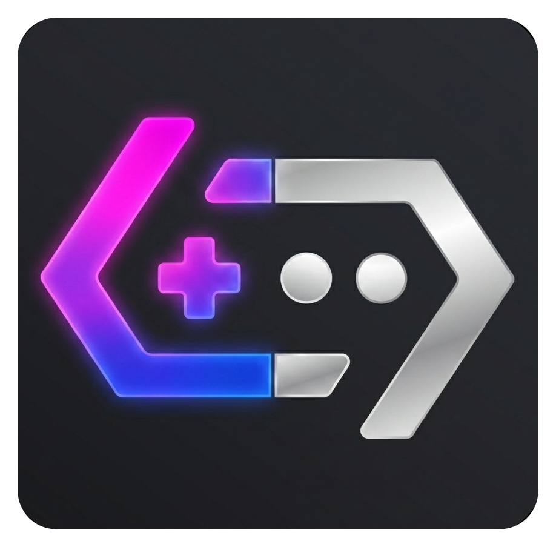

<p align="center">
  
</p>

<h1 align="center">BannerHub v6 for ReVanced</h1>

<p align="center">
  Pre-built APKs and the patch bundle that produces them — built on top of <a href="https://gamehub.xiaoji.com/">XiaoJi GameHub</a> 6.0.9 (<code>com.xiaoji.egggame</code>).
</p>

<p align="center">
  <a href="https://discord.gg/n8S4G2WZQ4"></a>
  <a href="https://github.com/The412Banner/bannerhub-revanced/releases"></a>
  <a href="https://github.com/The412Banner/bannerhub-revanced/releases/latest"></a>
</p>

<p align="center">
  <a href="https://github.com/The412Banner/bannerhub-revanced/releases/tag/v1.0.0-609"><strong>📥 Latest stable: v1.0.0-609</strong></a>
  ·
  <a href="#patches-applied">Patches</a>
  ·
  <a href="PRIVACY.md">Privacy</a>
  ·
  <a href="#signing">Signing</a>
  ·
  <a href="#build-it-yourself">Build it yourself</a>
  ·
  <a href="#ai-disclaimer">AI disclaimer</a>
</p>

---

> ## ⚠️ Important — please read before installing
>
> **BannerHub v6 does NOT replace BannerHub 3.7.x or BannerHub Lite — they are SEPARATE projects.**
>
> - [**BannerHub**](https://github.com/The412Banner/BannerHub) 3.7.x — built from the GameHub 5.3.5 ReVanced project by **PlayDay**.
> - [**BannerHub Lite**](https://github.com/The412Banner/Bannerhub-Lite) — built from GameHub Lite 5.1.4 by **Producdevity**.
> - **BannerHub v6** *(this repo)* — built from XiaoJi GameHub 6.0.x on a brand-new pipeline.
>
> **None of the three are to be updated over by any of the others.** Each ships with its own package names, its own keystore, and its own component / Steam-client backend — Android won't accept an in-place update between them, and forcing one will leave you with a broken install. Uninstall first, then install the new project if you want to switch.
>
> Keep in mind **BannerHub v6 is still a work in progress** and will re-release frequently as new base GameHub versions come out from XiaoJi upstream. **Compatibility is different** — don't expect every game that works on BannerHub 3.7.x or Lite to work on v6, and vice versa. v6 uses a **new component system and new Steam clients** and, thus far, has been **barely tested in general**.
>
> **USE AT YOUR OWN RISK.**

**What it does** — removes the login requirement, redirects the catalog API to the BannerHub Cloudflare Worker, ships **preload-free** PC-accurate XInput rumble for Wine games (with a per-game settings dialog injected into both popup menus), adds in-app **GOG** sign-in / library / download-install reachable from a new BannerHub-owned **Explore** tab, mutes the UI feedback sounds (with an optional recording-compatible audio toggle), and rebrands the launcher icon + in-app artwork as BannerHub v6. Nine APK variants install side-by-side on the same device. (On the 6.0.9 base there's **no separate Lite** — XiaoJi's own −46% size pass already makes the full build smaller than the old 6.0.4 Lite, so the Lite concept is absorbed. See [What's new](#whats-new-in-v100-609).)

> ✅ **In-place updates** — BannerHub releases are signed with a stable test keystore ([`keystore/README.md`](keystore/README.md)) so every stable installs on top of the previous one with no uninstall. The 6.0.9 line **shares the same keystore as the 6.0.8, 6.0.7 and 6.0.4 lines**, so `v1.0.0-609` installs straight over your existing BannerHub v6 — no uninstall needed when moving from the `-608`, `-607` or `-604` series. **One-time migration only applies if you're still on `v1.0.0-604` or older** (those used per-run ephemeral keys): uninstall once, then install. From there on, regular Android updates flow normally.

## Table of contents

1. [AI Disclaimer](#ai-disclaimer)
2. [What's new in v1.0.0-609](#whats-new-in-v100-609)
3. [What this is](#what-this-is)
4. [Source](#source)
5. [Variants](#variants)
6. [Frontend support](#frontend-support)
7. [Signing](#signing)
8. [Patches applied](#patches-applied)
9. [Build it yourself](#build-it-yourself)
10. [Releases](#releases)
11. [Credits](#credits)
12. [License](#license)

## AI Disclaimer

This project has no source code — XiaoJi GameHub is closed-source and ships only the compiled APK. To work on it at all, every GameHub release has to be decompiled, mapped, and patched at the bytecode level. **Claude AI Sonnet 4.6** by Anthropic is used across that whole pipeline:

- **Decompile & analyse the APK.** Every new GameHub release is pulled to my Android phone and decompiled inside [Termux](https://termux.dev/) using [apktool](https://apktool.org/) (installed via Termux's `pkg` package manager). Claude then maps the resulting smali / manifest / resource tree — full R8 class-letter map, Compose Multiplatform resource layout, manifest deltas vs the previous release — and the analysis is checked into the [`gamehub_reports/`](gamehub_reports/) folder so the same map can be referenced across versions.
- **Write / rewrite ReVanced patches.** Claude helps author new patches against the current GameHub release **and port the older patches forward** from the GameHub **5.3.5** ReVanced project. Because R8 reshuffles every class letter on every minor-version bump (6.0.0 → 6.0.1 → 6.0.2 → 6.0.4 each completely renumbered the smali class names), every patch's structural anchors have to be re-derived against the new release — Claude does the heavy lifting on that re-derivation. Patches themselves are written in Kotlin against the ReVanced patcher API; Java "extension" helpers (`.rve`) handle anything too fiddly for raw smali edits.
- **Build & iterate.** Builds run on GitHub Actions CI (never on the phone). Every iteration is pushed up, CI patches all 9 variants, and the artefacts are pulled back to the phone for install + on-device test.

Before any **stable release** is published, every change is **manually debugged and tested by me across multiple devices — both rooted and unrooted**. Debugging uses `logcat` output (captured with the [`getlog` Magisk helper](https://github.com/The412Banner/logcat-bridge) on rooted devices, plain `adb logcat` on unrooted) plus the in-app debug log files that the `Debug logging` patch produces. No release is cut until the change has been verified end-to-end on hardware.

## What's new in v1.0.0-609

The headline of this release: **the GameHub 6.0.9 rebase.** BannerHub v6 moves from the 6.0.8 base (versionCode 119) to **XiaoJi GameHub 6.0.9** (versionCode 121) — XiaoJi's first feature release of the 6.0.x line. Every BannerHub patch was **re-fingerprinted against 6.0.9's reshuffled bytecode and confirmed on-device**; the full v6 feature set carries over unchanged. Same stable keystore, so it installs straight over any `-608` build — no uninstall.

### 🔁 Rebased onto GameHub 6.0.9 (versionCode 121)

6.0.9 is a **feature release** upstream (native "Team Room" co-op + Tencent in-room voice) — **not** a runtime change: no Wine / DXVK / Box64 / FEX / Mesa Turnip changes, so component compatibility is unaffected. As always the upstream R8 obfuscation reshuffle broke the usual set of patch anchors; all were **re-derived and device-verified**:

- **Per-game menu chain** — the keystone per-game id capture, the Banner Tools row + consolidated dialog, the PC Vibration Settings row, Show Game ID, and the GOG row, all re-pinned (including 6.0.9's new **resource-descriptor menu-row icon model**, which caused a one-build icon crash that's now fixed).
- **PC-accurate controller vibration** — re-pinned + device-confirmed (independent dual-motor, intensity scaling, and **sustained holds** via the on-disk `winebus.so` patch).
- **Offline component picker** — re-pinned **and fixed**: it now correctly lists your already-downloaded components offline. A long-standing result-wrapper bug (present on earlier bases) was caught and cured in this rebase, so this is the first build where the offline picker actually populates.
- **Bypass login, catalog redirect + `/v6` prefix, debug logging, Explore tab hijack, Show PC Game Settings, and the analytics/telemetry strips** — all re-pinned + verified (analytics redirect device-confirmed via a live network capture: zero telemetry egress).

> **Upstream's own Team Room voice** (Tencent TRTC) ships in 6.0.9 but is gated behind XiaoJi's cloud "Instant Play" recharge service, so it never unlocks on these builds — BannerHub's WebRTC in-game voice overlay stays the working in-game voice.

### ✅ Everything carries over

The full v6 feature set is intact and device-verified on 6.0.9: the **in-game Steam chat overlay + voice calls** (1:1 + party mesh, movable/collapsible call box, incoming-call ring with the caller's name + 30s auto-dismiss, ringtone settings, 🔗 share-call browser-guest link, 3-tab emoji/emoticon/sticker picker, send-image via the Worker, game-invite cards, typing indicators, pill 🎧/unread badges) — including **voice room codes** (create/join a shared room by a 5-character code, **cross-compatible with BannerHub 3.8.0** in either direction). Plus the **🔒 full Firebase Crashlytics shutoff** (see [`PRIVACY.md`](PRIVACY.md)), **GOG integration**, the **BannerHub Explore homepage** (What's New article, live `bh_explore.json` override, in-app update check + installed-vs-latest readout), **PC-accurate controller vibration** (preload-free — no `libevshim`/`LD_PRELOAD`), the **in-game performance overlay** (root), **recording-compatible audio**, the **offline component picker**, the strict per-game settings store, the synthetic 32-bit ID rewrite for external front-ends (Beacon / ES-DE / RetroHRAI / NeoStation), the always-visible PC Game Settings row, the privacy-hardening stack + public [`PRIVACY.md`](PRIVACY.md), the stable keystore, and the BannerHub v6 visual rebrand. Still **no separate Lite** build, and the **GPU Spoof** + **Legacy renderer (GLES2)** tiles stay retired. The Banner Tools grid stays **Vibration · Game ID · Audio · GOG · Overlay · Root**.

> 📜 Past-release notes for the entire `-608` line (`v1.3.1-608` down through `v1.0.0-608`), the `-607` line (`v1.0.0-607`), and the entire `-604` line (`v1.8.0-604` down through `v1.0.0-604`, plus `v1.0.0-602`, `v1.0.1-601`, `v1.0.0-601`, and `v1.0.1-600`) are preserved on their respective [release pages](https://github.com/The412Banner/bannerhub-revanced/releases). The README keeps only the current release in this section.

---

## What this is

GameHub 6.0 (the KMP rewrite under the package `com.xiaoji.egggame`) gates the entire game-library flow behind a login screen, ships with bundled UI feedback sounds, and hits XiaoJi's `landscape-api-{cn,oversea}.vgabc.com` catalog endpoints for the component (driver / DXVK / FEX / Wine prefix / firmware) registry that drives every game launch. This patch bundle changes all three:

- **No login** — six bytecode rewrites short-circuit the auth gate so a fresh install lands on the home screen, the **Import → Save** dialog persists rows to the on-device Room database (`db_game_library.db`), and the imported games appear in the library list — all without ever logging in or hitting the upstream auth endpoint.
- **Catalog redirect to the BannerHub Cloudflare Worker** — both `landscape-api-*.vgabc.com` hosts on the `xrj` `Online` enum value are swapped for `bannerhub-api.the412banner.workers.dev`, and a single chokepoint helper (`vob.b`) is hooked to prefix every relative API call with `v6/`. The Worker uses the prefix to serve 6.0-specific response shapes (firmware 1.3.5, `EnvListData` wrapper required by 6.0's kotlinx-strict deserializer, etc.) while a parallel 5.x branch keeps the upstream shape for older clients.
- **Muted UI sounds** — bundled menu/click `.wav` assets are replaced with silent PCM at packaging time, no runtime audio routing is touched.

It also fixes a launch-time `VerifyError` that the original 5.x `Disable Crashlytics` patch caused on 6.0, ships a diagnostic `Debug logging` probe (kept for ongoing triage convenience even though the import flow is confirmed stable end-to-end), and includes an unrelated convenience patch (`File manager access`) that exposes a content provider for browsing GameHub's data dir from external file managers.

## Source

- **Base APK:** `GameHub_6.0.9.apk` — the official 6.0.9 global build (versionCode 121), attached unmodified to the [`base-apk-609`](https://github.com/The412Banner/bannerhub-revanced/releases/tag/base-apk-609) release for reproducibility. Earlier base APKs remain attached to [`base-apk-608`](https://github.com/The412Banner/bannerhub-revanced/releases/tag/base-apk-608) (6.0.8), [`base-apk-607`](https://github.com/The412Banner/bannerhub-revanced/releases/tag/base-apk-607) (6.0.7), [`base-apk-604`](https://github.com/The412Banner/bannerhub-revanced/releases/tag/base-apk-604) (6.0.4), [`base-apk-602`](https://github.com/The412Banner/bannerhub-revanced/releases/tag/base-apk-602) (6.0.2), [`base-apk-601`](https://github.com/The412Banner/bannerhub-revanced/releases/tag/base-apk-601) (6.0.1) and [`base-apk-600`](https://github.com/The412Banner/bannerhub-revanced/releases/tag/base-apk-600) (6.0.0) for older releases.
- **Patcher:** [ReVanced CLI 6.0.0](https://github.com/ReVanced/revanced-cli/releases/tag/v6.0.0) + the bundle built from this repo's `gamehub-609-build` branch (`gamehub-607-build`, `gamehub-604-build`, `gamehub-602-build`, `gamehub-601-build`, and `gamehub-600-build` remain in place for older 6.0.x work).
- **Catalog backend:** [`The412Banner/bannerhub-api`](https://github.com/The412Banner/bannerhub-api) — Cloudflare Worker source, deployed at `bannerhub-api.the412banner.workers.dev`. Serves the curated component catalog from GitHub Pages and forwards unallowlisted paths back to upstream `landscape-api.vgabc.com` with the original signed-request behavior preserved.
- **Build environment:** GitHub Actions, Ubuntu 24.04 runner, Temurin JDK 17. The full pipeline is [`.github/workflows/release.yml`](.github/workflows/release.yml): a `build` job produces the `.rvp` patch bundle, a 9-way matrix patches the base APK in parallel (one variant per matrix entry), and a final `release` job globs all artefacts into a single GitHub Release when triggered with `stable=true`.

## Variants

The same patch bundle is applied to the same base APK 9 times, each time with a different package name + launcher label so the variants install **side-by-side** on the same device. The `Original` variant keeps the upstream package name `com.xiaoji.egggame` and so **replaces** an installed GameHub on install; everything else coexists.

| Variant | APK file | Package | Launcher label |
| --- | --- | --- | --- |
| Normal | `BannerHub-V6-<version>-Patched-Normal.apk` | `banner.hub` | BannerHub v6 |
| Normal-GHL | `BannerHub-V6-<version>-Patched-Normal-GHL.apk` | `gamehub.lite` | BannerHub v6 |
| PuBG | `BannerHub-V6-<version>-Patched-PuBG.apk` | `com.tencent.ig` | BannerHub v6 PuBG |
| AnTuTu | `BannerHub-V6-<version>-Patched-AnTuTu.apk` | `com.antutu.ABenchMark` | BannerHub v6 AnTuTu |
| alt-AnTuTu | `BannerHub-V6-<version>-Patched-alt-AnTuTu.apk` | `com.antutu.benchmark.full` | BannerHub v6 AnTuTu |
| PuBG-CrossFire | `BannerHub-V6-<version>-Patched-PuBG-CrossFire.apk` | `com.tencent.tmgp.cf` | BannerHub v6 PuBG CrossFire |
| Ludashi | `BannerHub-V6-<version>-Patched-Ludashi.apk` | `com.ludashi.aibench` | BannerHub v6 Ludashi |
| Genshin | `BannerHub-V6-<version>-Patched-Genshin.apk` | `com.miHoYo.GenshinImpact` | BannerHub v6 Genshin |
| Original | `BannerHub-V6-<version>-Patched-Original.apk` | `com.xiaoji.egggame` | BannerHub v6 |

Three variants (Normal, Normal-GHL, Original) share the bare "BannerHub v6" launcher label and the two AnTuTu variants share "BannerHub v6 AnTuTu" — they install side-by-side via different package names, so the shared labels are intentional.

### 🪶 No Lite on the 6.0.9 base

The `-604` line shipped a separate ~34.5 MB-smaller **Lite** counterpart of each variant. **The 6.0.7, 6.0.8 and 6.0.9 lines do not** — and don't need to. XiaoJi's own −46% size pass since 6.0.7 (MiSans font dedup, PNG→WebP recompress, codec/SDK removals) already brings the full build well under the old 6.0.4 Lite, **smaller than the old 6.0.4 Lite ever was**. A distinct Lite would strip nothing extra, so the Lite concept is **absorbed into every full variant**. The historical Lite write-up for the 604 line is preserved at [`bannerhub-v6-lite.md`](bannerhub-v6-lite.md).

## Frontend support

BannerHub v6 can be driven directly from external game-launcher front-ends — pick a game in your front-end, it hands off into the matching BannerHub variant, and (with `autoStartGame true`) the game starts playing without a stop in GameHub's UI. The same intent contract is shared across all 9 variants — only the package name and action prefix change per variant. The **placeholder syntax** for substituting the game's ID into the `am` command differs by front-end family (Beacon-style `{file_content}` vs. RetroHRAI / NeoStation / Daijishou-style `{tags.localgameid}`); both are documented in the setup guide.

| Frontend | Status | Placeholder |
| --- | --- | --- |
| **Beacon** | ✅ Device-verified working | `{file_content}` |
| **ES-DE** | ✅ Device-verified working | `{file_content}` |
| **RetroHRAI** | ✅ Device-verified working (v1.5.1-604) | `{tags.localgameid}` |
| **NeoStation** | ✅ Device-verified working (v1.5.1-604) | `{tags.localgameid}` |
| **Daijishou** | ⚠️ Untested (same intent contract — *should* work with the RetroHRAI command form; please report results) | `{tags.localgameid}` |

What's addressable: PC-imported games, Steam-library games, and — as of `v1.5.1-604` — Epic-library and GOG-imported games (the synthetic-ID rewrite turns rows GameHub stamps with `server_game_id = 0`/`-1` into stable individually-addressable integer IDs). Game-ID lookup is via the in-app **Banner Tools → Show Game ID** dialog (added v1.5.0-604, consolidated into Banner Tools in v1.5.1-604).

### 📺 Video walkthroughs

- **Beacon** — [youtu.be/hyjjs-ffpw4](https://youtu.be/hyjjs-ffpw4?si=Lp6CCGhwFKGR0tAA) (also covers creating PC-import game `.txt` / `.iso` files with GameID numbers)
- **RetroHRAI** — [youtu.be/tcYGLLRtCPY](https://youtu.be/tcYGLLRtCPY?si=0oEWYZo-8QopFQey)
- **NeoStation** — [youtu.be/mTn7La43LpQ](https://youtu.be/mTn7La43LpQ?si=4PPV_gpKl_AwTchM)

> 📖 **Full setup guide for all 9 variants → [`beacon-setup.md`](beacon-setup.md)** — per-variant `am` launch commands for both placeholder families, intent contract + extras (`localGameId` / `steamAppId` / `autoStartGame`), how to find a game's ID (in-app dialog + rooted `sqlite3` fallback), and the list of game types that aren't addressable.

## Signing

From `v1.1.0-604` onward, every release is signed with the **public test keystore** at [`keystore/bannerhub.keystore`](keystore/bannerhub.keystore). The keystore + passwords are intentionally committed to the repo so the signing cert is reproducible across releases — that's what enables in-place Android updates between BannerHub stables.

- **Alias:** `bannerhub`
- **Store/key password:** `bannerhub`
- **Cert SHA-256:** `10:89:5A:31:1F:E0:4F:95:F8:2E:4D:A5:C9:A6:C0:41:BA:92:82:BF:21:1F:1B:57:8F:E1:CB:EB:89:4C:E0:BA`
- **Cert SHA-1:** `1F:51:B2:5E:5C:9F:58:08:E0:CF:45:17:4F:CC:B3:8D:67:CA:6D:E5`
- **Schemes:** v1 + v2 + v3 (v4 disabled — needs a `.idsig` sidecar we don't ship)
- **Validity:** 100 years (until 2126-04-19)

Every CI release run prints the cert SHA-256 via `apksigner verify --print-certs` so the same fingerprint can be cross-checked against this README. See [`keystore/README.md`](keystore/README.md) for the full security model + the one-time migration note from `v1.0.0-604`-or-older.

## Patches applied

<details>
<summary><strong>📦 Click to expand the full patch list (17 patches + disabled-by-default options)</strong></summary>

This bundle ships only patches that successfully apply against GameHub 6.0. Every patch below appears as an individually-named, individually-toggleable entry in the published `.rvp` bundle (`revanced-cli list-patches patches.rvp` to enumerate; `--include` / `--exclude` to pick).

### `Bypass login`

Skips the login screen entirely and makes the library system function under a synthetic identity. Six bytecode rewrites cooperate (the walkthrough below uses the 6.0.2 R8 letter names for historical continuity; every version's letters — including the current 6.0.9 mappings — are recorded in the per-patch source comments and the [`gamehub_reports/`](gamehub_reports/) maps. The patch *mechanics* are identical across versions — only the class letters differ.):

1. **`xle.i(gi0)` and `xle.r(gi0)`** — the navigator methods that gate Login routing. Original logic does `iget Lxle;->b:Lct0;` → `invoke-interface Lct0;->a()Z` → `if-nez :skipLogin` → otherwise build a `Lsa0;` Login navigation intent. Patch removes the `invoke-interface`/`move-result` pair and substitutes `const/4 vN, 0x1` so the branch is always taken.
2. **`rr0.a(...)`** — a separate `NavigationInterceptor` (`getOrder()==10`) added in 6.0.1 that gates on `Lct0;->a()Z` independently of the navigator. Same iget+invoke-interface+if-nez pattern; bypassed identically with `const/4 vN, 0x1`.
3. **`it0.h()`** — the real DB-backed `Lct0;` implementation's `isLoggedIn` `StateFlow<Boolean?>`. Body replaced to return `FakeStateFlow.boolTrue()` (a host-compatible `Lhzh;` wrapping `Ltjk;(Boolean.TRUE)`, built via reflection in the Java extension and cached) so every collector — `NavHost.collectAsState`, the listener, the analytics pipeline — sees a logged-in state.
4. **`it0.e()`** — the user-account `StateFlow<fpm?>`. Without an `auth_token` row in the DB this emits `null` and the library-list reader's `flatMapLatest` collapses to an empty `Flow`. Patch replaces the body with `FakeStateFlow.userFlow()` where the underlying value is `FakeUserAccount.get()`, a Java extension that reflectively constructs `Lfpm;` via `Class.forName("fpm").getDeclaredConstructor(...)`, with `a="99999"` and every other field zeroed/empty. Result: the library reader's pipeline `it0.e().flatMapLatest { fpm -> dao.subjectAllByUserId(fpm.a) }` always queries with `user_id="99999"` and returns the imported rows.
5. **`uu7.e()`** — the `GameLibraryRepository`'s user-id getter (was `hp7.f()` in 6.0.1; the method was renamed between minor versions). Returns `"99999"` directly so it matches the synthetic user account.
6. **`ct0.f()`** — the interface default method that returns the current `kpm` auth token. Body replaced to call `FakeAuthToken.get()`, a Java extension that reflectively constructs `Lkpm;` with `a="99999"` and `b=""`. Several lambdas use this directly to read the user-id for network-prep and lambda capture; under the bypass they all see the same synthetic identity.

End-to-end consequence: a fresh install lands on the home screen, the **Import** dialog opens, picking an APK + metadata + tapping **Save** persists a row into `/data/data/<pkg>/databases/db_game_library.db` (`t_game_library_base`, `t_game_launch_method`), and the row appears in the library list immediately because the read pipeline is now keyed off the matching synthetic user-id.

### `Disable Firebase Crashlytics`

Removes the Firebase Crashlytics initialisation block. Without this, GameHub 6.0 crashes on launch with `VerifyError`. Root cause: the upstream 5.x patch used `goto` to skip the Crashlytics call site, which in 6.0 leaves a join-point where the same register holds either `String` (goto path) or `Boolean` (fall-through path) and the ART verifier rejects it. The 6.0-compatible patch removes the three Crashlytics instructions in **reverse index order** (`setCrashlyticsCollectionEnabled`, `move-result-object`, `invoke-static getInstance`) so the intermediate `const/4 v2, 0x0` redefines the register with a consistent `Boolean` type at the join point. Anchored on `Lcom/xiaoji/egggame/BaseAndroidApp;->onCreate` plus full Firebase class names, so it ports across versions without source change.

### `Mute UI sounds`

Replaces the bundled UI feedback sounds (`assets/composeResources/com.xiaoji.egggame.core/files/sound/*.wav`) with silent PCM. Menu navigation and button taps stop clicking. The patch substitutes the resource at packaging time — no runtime audio routing is changed, so game audio is unaffected. The patch's resource lookup is anchored on a Kotlin `object {}` to give the classloader a stable handle (the alternative — anchoring on the patch class itself — fails when ReVanced's class loader can't see the patches module's resources from inside the runner JVM).

### `PC-accurate vibration` ⭐ *new in v1.1.0-604 · reworked preload-free in v1.3.0-604*

Four bytecode hooks (`GamepadServerManager.onRumble` entry + per-controller dispatch + stop + Wine env-builder pre-launch trigger) route XInput rumble from Wine games into Android's `VibratorManager` with dual-motor independent dispatch on multi-motor pads, intensity blending on single-motor pads, sustained-hold keepalive, and instant release on let-go. The `BhVibrationController` Java extension owns the state machine (per-slot motor amplitudes, keepalive worker thread, mode dispatch: off/device/controller/both, per-game intensity scaling) **and the preload-free winebus disk patcher** (see below). Adapted from [TideGear/GameHub-Vibration-Fix](https://github.com/TideGear/GameHub-Vibration-Fix) (GameNative PR #1214 lineage) with the author's permission; class-letter map derived for 6.0.4.

**Preload-free sustained holds (replaces the former `libevshim.so` shim).** Earlier builds shipped an `arm64-v8a` `libevshim.so` and `LD_PRELOAD`'d it into Wine via Hook 4. Mapping any extra `.so` into the Wine subprocess destabilises box64 under new-WoW64 and silently kills a class of x86_64/32-bit game launches (DiRT 3 → `STATUS_INVALID_IMAGE_FORMAT` `c000007b`; Shotgun King → ~700 ms exit). That shim, its `LD_PRELOAD` inject, the `native/evshim/` C sources and the CI NDK build step are all **removed**. Instead, Hook 4 calls `BhVibrationController.ensureWinebusDurationPatchOnce(ctx)` once per app process — right before the env builder hands off to the Wine launcher — which scans the app files tree and rewrites every `winebus.so`'s two non-zero `SDL_JoystickRumble` duration loads to `0xffffffff` **on disk** (aarch64 `ldur w3,[x29,#-0x14]`→`mov w3,#-1`; x86_64 11-byte clang window → `or ecx,-1`), so SDL2's ~1 s `rumble_expiration` never fires. An `AtomicBoolean` gates repeat scans; an x86_64 pattern miss dumps `<externalFilesDir>/winebus_dump_x86_64.so` for re-derivation. No native shim, no `LD_PRELOAD`, nothing extra mapped into Wine.

### `Vibration settings activity` ⭐ *new in v1.1.0-604 · strict per-game store in v1.3.0-604*

Registers `com.xj.winemu.vibration.BhVibrationSettingsActivity` in the patched manifest (`exported="false"`, translucent theme). The activity hosts a programmatic dialog (mode picker: off / device / controller / both + intensity slider 0–100%) with explicit **Save** and **Cancel** buttons — a single atomic commit on Save, full discard on Cancel; no live-write on every spinner/slider change. Internal-only — no `<intent-filter>` — launched only by the menu-row patch below via explicit `Intent`.

**Strict per-game storage (v1.3.0-604).** The dialog (and the GPU Spoof / Legacy-renderer dialogs, which share this model) persists *only* to BannerHub's own `bh_vibration_prefs` SharedPreferences, keyed strictly per game (`<base>__<gameId>`). It never writes GameHub's own `pc_g_setting<gameId>` file (the host rewrites that, which silently reset our keys → "reverts to default on reopen") and keeps **no global mirror and no global fallback** (a per-game choice used to leak app-wide and into other games). A game with no saved setting yields the stock default, never another game's value; a one-time read-only migration adopts any legacy `pc_g_setting`/old-global value on first read. The gameId is resolved across the main↔`:wine` process boundary via the shared `BhMenuGameId` disk-bridge — `WineActivity` runs in `android:process=":wine"`, so a Java static set in the UI process is invisible at launch; the captured id is mirrored to SharedPreferences (`bh_menu_gameid`) with a synchronous commit and read back launch-side. This same `:wine` boundary bit all three per-game features (GPU Spoof, Legacy renderer, vibration); each launch/clinit-time resolver now uses `BhMenuGameId.getCaptured()` first, never stack-sniff-only.

### `PC Vibration Settings menu row` ⭐ *new in v1.1.0-604*

Injects a 5th row labelled **PC Vibration Settings** into both per-game popup menus in GameHub 6.0.4:

- **Game-details "More Menu"** — patched in `Lx57.a()` at the tail of the row-list builder. Each row is an `Iae(icon, label, onClick)` with `Lpw6;` (`Function1`) onClick.
- **Library-tile 3-dot popup** — patched in `Lpzc.j0()` by hooking the list's return. Each row is a `Lz4e(Lell label, Lnw6 onClick, int)` — different row class, different click-handler interface (`Lnw6;` = `Function0`), and the label is a Compose Multiplatform resource descriptor (`Lell`) not a raw String.

Both injections route through a single Java helper (`BhMenuRowClick`) that walks `ActivityThread.mActivities` to find the current top Activity and fires `startActivity(BhVibrationSettingsActivity, gameId)` — gameId captured via the shared `BhMenuGameId` helper (mirrored to disk for the `:wine` boundary, see *Vibration settings activity* above) so the dialog and the launch-time controller scope to the same game. Three architectural curiosities solved along the way:

- **R8 renamed `kotlin.jvm.functions.Function0/Function1`** to `Lnw6;` / `Lpw6;` everywhere in the host APK. The extension's own `implements Function1` is a different JVM class at runtime — fails `pw6Cls.isInstance()`. Fix: wrap each click handler in a `java.lang.reflect.Proxy` that actually implements the renamed interface.
- **`Lell` is a Kotlin empty subclass** of abstract `Ltdi(String key, Set<String> locales)` and declares zero constructors of its own. `getDeclaredConstructor(...)` returns nothing. Fix: `sun.misc.Unsafe.allocateInstance` skips ctor invocation; then reflect-set the inherited `Ltdi.a` (key) and `Ltdi.b` (locale set) fields.
- **`Lxd3.l1` resolver throws on unknown Compose resource keys** — and the runtime requires a manifest registration the bare `.cvr` append doesn't provide. Fix: a third bytecode injection at the head of `Lxd3.l1` short-circuits our sentinel key `bh_pc_vibration_label` and returns the literal string `"PC Vibration Settings"` before the stock resource lookup runs.

The 10-iteration debugging trail behind landing this patch is recorded in `project_bannerhub_revanced_menu_injection_playbook.md` (auto-memory) and `PROGRESS_LOG.md`. Future menu-row additions should start there.

### `PC Vibration Settings label resource` ⭐ *new in v1.1.0-604*

Appends a `bh_pc_vibration_label = "PC Vibration Settings"` entry to `features.home`'s Compose Multiplatform resource bundle (`.cvr` file). Documentation patch — the runtime resolution actually goes through the `Lxd3.l1` short-circuit described above because Compose's resource manifest needs entries the bare `.cvr` doesn't register. Kept anyway so the resource is reachable by any future patch that goes through the proper manifest registration path.

### `GPU Spoof` 🔒 *6.0.4-only — not in the 607/608/609 build*

> **Pinned to 6.0.4.** GameHub 6.0.7, 6.0.8, and 6.0.9 ship a **native GPU spoof** of their own, so this patch is redundant there and is gated out (`compatibleWith("6.0.4")`) — the tile does not appear on the 607/608/609 Banner Tools grid. The description below applies to the `-604` line.

Adds a **GPU Spoof** row to both per-game popup menus. The dialog offers **Off** (default), a **preset** GPU picker (a legacy NVIDIA/AMD/Intel list plus a modern RTX/RX/Arc set), or **Custom** (free vendor / device hex + name). `GpuSpoofPatch` ("GPU spoof DXVK plumbing") force-writes the chosen `customVendorId`/`customDeviceId` into a per-game `dxvk.conf` and points `DXVK_CONFIG_FILE` at it, injected *after* the Wine env builder's conditional DXVK block so the spoof always applies. No-ops entirely when the game's mode is Off. Fixes titles that hard-refuse an "unsupported video card" (CryEngine — Crysis 2). The `BhGpuSpoofController` owns mode state (Off / preset / custom); storage is the shared strict per-game store (see *Strict per-game settings store* below). Free-text adapter names go only to the `dxvk.conf` file, never the whitespace-splitting inline `DXVK_CONFIG`, so "NVIDIA GeForce RTX 4080" isn't truncated to "NVIDIA".

### `Legacy renderer (GLES2) toggle` 🔒 *6.0.4-only — not in the 607/608/609 build*

> **Pinned to 6.0.4.** The rewritten Vulkan X-server in 6.0.7/6.0.8/6.0.9 is **incompatible** with the old GLES2 `libxserver.so` / `libwinemu.so` pair — forcing the legacy path on 607/608/609 is a device-confirmed `SIGABRT`. The patch is gated out (`compatibleWith("6.0.4")`) and the Renderer tile does not appear on the 607/608/609 Banner Tools grid. The description below applies to the `-604` line.

GameHub 6.0.4 rewrote its X-server renderer from GLES2 to Vulkan (`libxserver.so`). Some games regressed. A **Renderer** menu row + dialog adds a per-game choice: **New** (default — stock 6.0.4 Vulkan, zero patch effect) or **Legacy** (the proven 6.0.2 GLES2-era `libxserver.so` + `libwinemu.so` pair). `RendererLibBundlePatch` bundles the 6.0.2 libs under a non-clobbering name; `RendererSwapPatch` adds a `setRenderingEnabled` native and routes `XServer`'s `loadLibrary` + `setFlipEnabled` call sites through `BhRendererController` so the swap is gated strictly per game — an unset game is pure stock, zero regression.

### `Strict per-game settings store` ⭐ *new in v1.4.0-604*

GPU Spoof, the Legacy renderer toggle, and PC Vibration all share one per-game persistence model. Each setting is stored **only** in BannerHub's own `bh_<feature>_prefs`, keyed strictly per game (`<base>__<gameId>`). It never writes GameHub's own `pc_g_setting<gameId>` (the host rewrites that, silently resetting our keys) and keeps **no global mirror and no global fallback** (a per-game choice used to leak app-wide / into other games). An unset game yields the stock default — never another game's value; a one-time read-only migration adopts any legacy value on first read. Each settings dialog has explicit **Save** (single atomic commit) and **Cancel** (discard) buttons — no live-write on every spinner/slider change.

`WineActivity` runs in `android:process=":wine"`, so a Java static set in the UI process is invisible to launch-time code. The shared `BhMenuGameId` helper mirrors the captured game id to SharedPreferences with a synchronous commit and reads it back launch-side, so every per-game feature resolves the right game across the process boundary.

### `Show PC Game Settings row` ⭐ *new in v1.2.0-604*

Forces the **PC Game Settings** row to appear in the Explorer game-detail More Menu for *every* game type, including Steam-linked games where XiaoJi-native logic would normally hide it. The patch removes the single `if-eqz` gate immediately preceding the row's construction in `Lx57;->a`; every other row keeps its native gating untouched.

### `Show Game ID menu row` ⭐ *new in v1.5.0-604*

Adds a **Show Game ID** row to both per-game popup menus and a third entry in the library-list popup (the 3-dot menu on each tile). Tapping it opens a small dialog that shows the active game's **Local Game ID** — the integer `server_game_id` GameHub assigns each row — with **Close**, **Copy** (when scoped to a specific game), and **View All Games** buttons.

The **View All Games** flow opens the GameHub library database (`db_game_library.db` Room, `t_game_library_base` table) **read-only** and renders the full library in a scrollable list — `<game name>` then `ID: <server_game_id>` (plus inline `· Steam: <appid>` / `· Epic: <UUID>` tags when those columns are populated), case-insensitive alphabetical. Tap any row → that game's id is copied to the clipboard with a toast. Pairs naturally with the **External launcher (Beacon / ES-DE / Daijishou)** support — users no longer need to grep logcat to find the id required by per-game external-launcher entries.

Structural sibling of *PC Vibration Settings menu row* / *GPU Spoof* / *Renderer*: three injection sites (`Lx57;->a` More Menu, `Lted;->f` library-tile popup, `Lpzc;->j0` library-list popup), each hands row construction to a Java helper (`BhGameIdDisplayMenuRowClick`) via a single `invoke-static`. **Reuses** the single shared `Lxd3;->l1` resolver hook the vibration patch already injects — one `else if` line is added to `BhMenuRowClick.maybeResolveCustomLabel` mapping `"string:bh_gameid_label" → "Show Game ID"`. No new resolver head-block (a 2nd one ANRs MainActivity cold-start — established in earlier menu-row work).

DB access is safe alongside the host's live Room writer: `SQLiteDatabase.OPEN_READONLY | NO_LOCALIZED_COLLATORS` against `getApplicationContext().getDatabasePath("db_game_library.db")`, with full fail-safe behaviour — absent file / missing table / any `SQLiteException` toasts a friendly message rather than crashing the menu flow. Resolves correctly across every variant pkg (`banner.hub`, `com.antutu.benchmark.full`, `gamehub.lite`, etc.) since `getDatabasePath` keys off the running app's data dir.

### `Show Game ID label resource` ⭐ *new in v1.5.0-604*

Companion to the menu-row patch — appends `bh_gameid_label = "Show Game ID"` to `features.home`'s Compose Multiplatform `.cvr` resource bundle across the 6 locale variants. Mirrors *PC Vibration Settings label resource* exactly: kept so the resource is reachable through any future manifest-aware resolver, even though runtime lookup currently goes through the shared `Lxd3;->l1` short-circuit.

### `Change app icon` ⭐ *new in v1.1.0-604*

Replaces five in-APK drawables with BannerHub v6 branding:

- **Launcher adaptive-icon foreground** (`res/drawable-xxxhdpi/ic_launcher_foreground.png`) — 432×432 raster with BannerHub logo content in the inner 288×288 safe zone. The stock GameHub vector at `res/drawable/ic_launcher_foreground.xml` is *deleted* so the new raster wins on every device density (Android downsamples from xxxhdpi for lower buckets — imperceptible at icon sizes; without the delete, lower-density devices would silently fall back to the stock vector).
- **In-app `wine_logo`** (`res/drawable-xxhdpi/wine_logo.png`) — 240×72 rebrand, dimensions matching stock so any `wrap_content` ImageView measuring against the resource keeps its 80×24 dp intrinsic size.
- **Auth-screen landscape logo** (`assets/composeResources/com.xiaoji.egggame.features.auth/drawable/features_auth_ic_logo_landscape.png`) — 96×96 square (the "landscape" in the name refers to auth-screen orientation, not image aspect).
- **Auth-screen overseas logo** (`.../features_auth_ic_logo_overseas.png`) — 366×72 wide rectangle.
- **Splash-screen banner** (`assets/composeResources/com.xiaoji.egggame.features.splash/drawable/splash_logo.png`) — 996×200 with 2 px transparent top/bottom pad for aspect preservation; RGBA so a future splash-background change can bleed through cleanly.

Background drawable (`res/drawable/ic_launcher_background.xml`) and CN-locale variants are left untouched — most launchers mask the adaptive icon's foreground so the background only shows at the masked edge, and the CN drawables aren't displayed on overseas builds.

### `GOG integration` ⭐ *new in v1.6.0-604*

A self-contained GOG client ported into the extension: WebView OAuth login, owned-library listing (`embed.gog.com`), multi-CDN download + install into the app data dir, and a programmatic bridge that writes the installed game into GameHub's library DB (`t_game_library_base` + `t_game_launch_method`, `LaunchType.GogGameByPcEmulator`) so it launches through the normal Wine pipeline like any PC game. Reached from the **GOG** Banner Tools tile and the Explore tab's GOG card — both open `GogMainActivity`. The library row is written on a foreign DB connection (GameHub uses Room's bundled SQLite driver), so a freshly added game appears after a GameHub restart; the add itself is verified on-device.

### `Explore tab hijack` + `Explore screen activity` + `Explore drawables` ⭐ *new in v1.6.0-604*

Hijacks the unused bottom-nav **Explore** tab. A one-instruction guard at the head of the bottom-nav controller's tab-select dispatch (`w1a.q(Lyw9;)V`) detects the Explore tab (enum ordinal 0) and opens our own `BannerExploreActivity` instead of XiaoJi's server-driven discovery feed — falling through to the stock screen on any error (fail-safe), and covering both handheld and explore layout modes from the single shared controller. The screen is classic Android views (no Compose), immersive-fullscreen, populated from a **bundled JSON manifest** so it works fully offline, with a **GOG** card whose logo is copied into `res/drawable` by the companion `Explore drawables` resource patch. Cards route to BannerHub's own destinations, never the server feed.

### `Recording-compatible audio` ⭐ *new in v1.6.0-604*

Global **Banner Tools → Audio** toggle that appends `pm=0` to PulseAudio's `module-aaudio-sink`, routing audio through the system mixer instead of the AAudio MMAP fast-path so MediaProjection screen recorders capture in-game sound (otherwise recordings are silent). Off by default; in-game audio path is otherwise untouched.

### `Redirect catalog API`

Patches the `xrj` environment enum's `Online` value so the catalog API's `cnHost` and `overseaHost` both point at the BannerHub Cloudflare Worker (`bannerhub-api.the412banner.workers.dev`) instead of `landscape-api-{cn,oversea}.vgabc.com`. The Worker:

- Serves a curated component catalog from `the412banner.github.io/bannerhub-api/` for `simulator/v2/*` and other allowlisted paths (drivers, DXVK, VKD3D, FEX, Box64, Wine prefix, firmware metadata).
- Reshapes responses for 6.0's kotlinx-strict deserializer (wraps `getAllComponentList` data in `EnvListData` `{list, page, page_size, total}` instead of a bare array — without this the cast silently fails and the in-memory COMPONENT registry stays empty, breaking game launch at "Download Game Config").
- Token-injects + signature-regens forwards for any unallowlisted path back to `landscape-api.vgabc.com` so anything not curated still works against the original upstream.
- Branches 6.0-only response variants behind a `/v6/` path prefix (see next patch); 5.x clients hitting the same Worker without the prefix get the upstream-shaped pass-through.

The Beta + Test enum values, the analytics hosts (`landscape-api-*-*.vgabc.com/events`), `clientgsw.vgabc.com`, and the bigeyes CDN are all intentionally untouched — only the curated-catalog hosts are swapped.

**Side benefit (PC game settings orientation):** the per-game **PC game settings** screen now renders correctly in both landscape *and* portrait orientation. Upstream's catalog response carried a constraint that the host honored by locking that screen to landscape only — the BannerHub Worker's payload doesn't include that constraint, so the picker is usable from a portrait-held phone for the first time. This is a behavioral byproduct of the catalog redirect, not a separate patch.

### `Prefix API path with /v6`

Hooks `vob.b(m7a builder, String path)` — the single static Ktor URL-builder helper through which every relative GameHub API request flows — and prepends `v6/` via the small `V6PathPrefix.prefix()` Java extension. The Worker strips the prefix and uses it as a feature gate so the same backend can serve 6.0 and 5.x clients side-by-side without divergent state:

- `/v6/simulator/v2/getAllComponentList` → `EnvListData`-wrapped response, reshaped for 6.0 (`is_ui` / `gpu_range` stripped, `fileType` / `framework` / `framework_type` / `is_steam` / `status` / `blurb` / `upgrade_msg` / `sub_data` / `base` injected, `base.fileType=0`).
- `/simulator/v2/getAllComponentList` (no prefix, from a 5.x client) → native upstream catalog passed through with `is_ui` / `gpu_range` preserved.
- `/v6/simulator/v2/getImagefsDetail` → firmware 1.3.5. Without prefix → firmware 1.3.3.

Full URLs (paths already starting with `http://` or `https://`) are short-circuited by the helper and pass through untouched, so direct downloads from the catalog's `download_url` fields still resolve to the Worker-authored GitHub-release URLs without the prefix being injected into them.

### `Offline component picker — local list`

> **Status:** Working — device-confirmed on 6.0.4. Offline, every per-game picker (GPU driver, DXVK, VKD3D, FEXCore/Box64 translators, **and the Wine/Proton container**) lists the components the user has already downloaded, in the same order as online. Online behaviour is byte-identical. Fully fail-safe: any error falls back to the original code path, so the worst case is the pre-patch behaviour, never a crash. Supersedes the earlier `Offline component cache fallback` (an `mci.a` hook that was forensically proven inert on 6.0.4 — wrong subsystem entirely; removed).

The 6.0.4 pickers are fed by `gof.a(ComponentType, …)` (per-type components) and `gof.c(Continuation)` (containers) — the repository methods behind `simulator/v2/getComponentList` / `getContainerList`. Both run even offline; the network fetch simply fails and the picker shows only the server-recommended/built-in set. The user's downloaded components *are* on disk and catalogued in `sp_winemu_unified_resources.xml`, but nothing reads that for the picker offline.

This patch replaces `gof.a`'s body with a delegate to `OfflineComponentList.dispatch(...)` and prepends a register-safe conditional short-circuit to `gof.c`:

1. **Online (or any failure):** reflectively invokes the original suspend impl (`gof.b` for components; the unmodified `gof.c` body for containers) and returns its value verbatim — coroutine suspension passes straight through, so online is unchanged.
2. **Offline:** synthesises the picker's exact return type — `n55(List<EnvLayerEntity>)`, the uniform repo result `zxf.a`/`zxf.c` unwrap — from the on-device `sp_winemu_unified_resources.xml` catalog. `COMPONENT:` entries are filtered by `ComponentType.type`; `CONTAINER:` entries feed the Wine/Proton picker. Each `EnvLayerEntity` is built via `Unsafe.allocateInstance` + reflective field-set (the catalog's `entry` JSON keys are 1:1 with the Kotlin field names).
3. **Ordering:** entries are stable-sorted by `OfflineComponentOrder` — a generated map of the canonical catalog order (from the Worker's static `simulator/v2/getComponentList`) — so DXVK / GPU-driver (and the rest) appear in the identical order to online (oldest→newest, newest at the bottom, curated `-async`/`-arm64ec` interleaving preserved). Regenerate `OfflineComponentOrder` when the catalog changes (parse `data.list` names in array order).

Every step is guarded; on any failure the methods fall through to the original network path, so a missing/[malformed] catalog silently degrades to stock behaviour. A throwaway `bh_offline_list.log` breadcrumb (app-private files dir) records `getList`/`getContainers built=N` for support and can be stripped for a clean ship.

### `Debug logging`

A diagnostic patch that:

- Sets `android:debuggable="true"` in the `<application>` manifest so `Log.d` / `Log.v` lines from the patched APK reach `logcat`.
- Inserts `Log.i("GH600-DEBUG", ...)` markers along the import code path: Save ENTRY/CATCH (now keyed on `uu7.v` — was `xm7.u` in 6.0.0/6.0.1), transaction body ENTRY (`vs7.invokeSuspend` — was `el7.invokeSuspend`), both Room DAO insert PRE markers (`GameLaunchMethodDao.insert`, `GameLibraryBaseDao.insert`), and per-call markers in `FakeAuthToken.get()`, `FakeUserAccount.get()`, and `FakeStateFlow.{boolTrue,userFlow}()`.
- Hooks the global `i86.e()` `Throwable` swallower (was `odb.e()` in 6.0.0/6.0.1) to surface every exception that the app's Kotlin coroutine state machines would otherwise eat silently.

Kept in this release for ongoing device-side triage; safe to drop in a future release if you want a leaner build.

### `File manager access`

Adds an exposed `MTDataFiles` content provider (Java extension class shipped in the patches `.rve`) so external file managers like MT Manager can browse GameHub's per-app data directory without needing root. The provider's `android:authorities` and the wake-up activity's `android:taskAffinity` are derived from `packageNameOption.value` so each variant gets its own values — required to avoid `INSTALL_FAILED_CONFLICTING_PROVIDER` when two variants are installed side-by-side.

### `Rewrite custom permissions per variant`

Iterates the manifest's `<permission>` and `<uses-permission>` elements and rewrites any name starting `com.xiaoji.egggame.permission.` so the prefix matches the variant's package. The notable case is the Mob Push SDK's `C2D_MESSAGE` permission, which upstream declares directly. Without this rewrite, two installed variants both declaring `com.xiaoji.egggame.permission.C2D_MESSAGE` violate Android 7+'s rule against multiple packages declaring the same custom permission, and the second-installed variant gets rejected with `INSTALL_FAILED_DUPLICATE_PERMISSION` (UI surfaces this as the unhelpful "package conflicts with a current package" dialog). Reads `packageNameOption.value` directly rather than relying on patcher ordering against `Change package name`.

### `Change package name` *(per variant)*

Rewrites the APK's `<manifest package=…>` and `<application>` references to the variant's value listed in the table above, plus rewrites compatibility receiver permissions and exported provider authorities so they don't collide with the upstream package. Driven by the `packageName` option, set per matrix entry in `release.yml`. The workflow also passes `updatePermissions=true` and `updateProviders=true` so the upstream-baked `DYNAMIC_RECEIVER_NOT_EXPORTED_PERMISSION` and the 10 inherited provider authorities are renamed to the variant package as well.

### `Change app name` *(per variant)*

Rewrites `<application android:label=…>` to the variant's value listed in the table above. Driven by the `appName` option, set per matrix entry.

### Disabled-by-default options

A handful of generic patches from upstream `patches/all/misc/` are included but `use = false` (must be opted in via `revanced-cli -e <name>`):

- `Custom network security`, `Enable Android debugging`, `Override certificate pinning`, plus the `Change app name` / `Change package name` patches we explicitly enable per variant.

Available for ad-hoc CLI use; have no effect on the released APKs unless explicitly enabled.

</details>

## Build it yourself

```sh
git clone https://github.com/The412Banner/bannerhub-revanced.git
cd bannerhub-revanced
git checkout gamehub-609-build

# 1. Build the patch bundle
./gradlew build

# 2. Get the base APK
gh release download base-apk-609 \
  --repo The412Banner/bannerhub-revanced \
  --pattern "GameHub_6.0.9.apk" \
  --output GameHub_6.0.9.apk

# 3. Get ReVanced CLI
curl -L https://github.com/ReVanced/revanced-cli/releases/download/v6.0.0/revanced-cli-6.0.0-all.jar \
  -o revanced-cli.jar

# 4. Patch it (single-variant example: Normal)
java -jar revanced-cli.jar patch GameHub_6.0.9.apk \
  --patches "$(find patches/build/libs -name '*.rvp' ! -name '*-sources*' ! -name '*-javadoc*' | head -1)" \
  --bypass-verification \
  -e "Change package name" -O 'packageName="banner.hub"' \
  -e "Change app name"     -O 'appName="GameHub"' \
  --out GameHub-6.0.9-Patched-Normal.apk
```

> **Note on `-O` quoting:** the JSON-string quotes around the value (`"…"` inside the single-quoted shell argument) are required. Picocli's `Map<String,Object>` parser auto-coerces values and trips on package names ending in `f`/`d`/`l` (Java numeric-literal suffixes — `com.tencent.tmgp.cf` is the canonical example).

## Releases

### Naming & versioning scheme

APK files follow the pattern **`BannerHub-V6-{version}-Patched-{variant}.apk`** — e.g. `BannerHub-V6-1.0.0-609-Patched-Normal.apk`. The version string has three parts:

- **BannerHub v6** — product name. Fixed; aligned with GameHub's 6.x series and stays put across upstream patch-version bumps.
- **`1.1.0`** — BannerHub-side semver (`major.minor.patch`). Tracks our own changes: new patches, infrastructure work, bug fixes. Bumps on every release.
- **`-609`** — GameHub base version with the dots stripped (`6.0.9` → `609`). Tells you which upstream GameHub APK was patched. When XiaoJi ships a new base, the suffix bumps (e.g. `-610`) and the patch set is re-fingerprinted and retargeted. The BannerHub-side semver restarts at `1.0.0` for each new base line (the `-604` line ran `v1.0.0-604` → `v1.8.0-604`; the `-607` line was a single `v1.0.0-607`; the `-608` line ran `v1.0.0-608` → `v1.3.1-608`; the `-609` line begins at `v1.0.0-609`).

The release tag (`v1.1.0-604`) is the version string with a leading `v`. The `{variant}` slot in the filename identifies which of the 9 side-by-side packagings you grabbed.

### Pipeline modes

The release pipeline has two modes:

- **Prerelease (default)** — every tag push and every `workflow_dispatch` run with `stable=false` produces the 9 variant APKs as Actions artifacts only (14-day retention). Useful for device-testing without cluttering the Releases page.
- **Stable** — `workflow_dispatch` from `Actions → Run workflow` with the **`stable`** checkbox ticked and a version (e.g. `1.0.0-608`) populated. The matrix runs as normal, then a final `release` job creates a GitHub Release with the 9 APKs, `.rvp` bundle, `.rve` extension files, and the release notes (sourced verbatim from `release.yml`). All 9 APKs are re-signed with the BannerHub keystore (`v1`+`v2`+`v3` schemes) before upload so the cert is stable across releases.

## Credits

BannerHub v6 is a patch bundle — almost nothing under the hood is our work. Every game launch under this APK rides on years of upstream open-source code. Huge thanks to everyone below.

> 💬 Want to be added, corrected, or removed? Open an issue or ping us in [Discord](https://discord.gg/n8S4G2WZQ4).

**Community testers** — special thanks to **Glitch** and **Stevolit** for the many cross-network test calls that helped get the in-game Steam voice chat (1:1 + party, `v1.3.0-608`) working and device-confirmed across different ISPs and NATs. 🙏

| Project | Role | Maintainer(s) |
| --- | --- | --- |
| [DXVK](https://github.com/doitsujin/dxvk) | Direct3D 9 / 10 / 11 → Vulkan translation | Philip Rebohle ([@doitsujin](https://github.com/doitsujin)) and contributors |
| [VKD3D-Proton](https://github.com/HansKristian-Work/vkd3d-proton) | Direct3D 12 → Vulkan translation (Proton fork) | Hans-Kristian Arntzen and Valve / VKD3D-Proton contributors |
| [Box64](https://github.com/ptitSeb/box64) | x86-64 → AArch64 dynamic recompiler | Sébastien Chevalier ([@ptitSeb](https://github.com/ptitSeb)) and contributors |
| [FEX-Emu (FEXCore)](https://github.com/FEX-Emu/FEX) | x86 / x86-64 → AArch64 emulator with Wine + JIT integration | FEX-Emu team — PPA flavour downstream of [FEX-Emu/FEX-ppa](https://github.com/FEX-Emu/FEX-ppa) |
| [Mesa Turnip](https://gitlab.freedesktop.org/mesa/mesa) | Open-source Vulkan driver for Qualcomm Adreno GPUs (part of [Mesa 3D](https://www.mesa3d.org/)) | Rob Clark, Connor Abbott, Danylo Piliaiev, and many contributors. Adreno forks BannerHub serves: [Banners-Turnip](https://github.com/The412Banner/Banners-Turnip), [StevenMXZ](https://github.com/StevenMXZ), [whitebelyash](https://github.com/whitebelyash). |
| [XiaoJi GameHub](https://gamehub.xiaoji.com/) | The closed-source host APK we patch | XiaoJi GameHub Team |
| [ReVanced](https://revanced.app/) | Patcher framework, CLI, and patch SDK | ReVanced team — source at [github.com/revanced](https://github.com/revanced) |
| [TideGear / GameHub-Vibration-Fix](https://github.com/TideGear/GameHub-Vibration-Fix) | The entire `PC-accurate vibration` patch is built on TideGear's work — the original rumble port (PR #80) and the **preload-free `winebus.so` disk-patch rework** (PR #91) that `v1.3.0-604` ships; both downstream of the GameNative PR #1214 lineage. Adapted with the author's explicit permission. | [@TideGear](https://github.com/TideGear) |
| [GameNative](https://github.com/utkarshdalal/GameNative) | Upstream Wine-on-Android rumble lineage (PR #1214) that TideGear's fix — and therefore our vibration patch — derives from | [@utkarshdalal](https://github.com/utkarshdalal) and GameNative contributors |

*If any attribution above is wrong, missing, or under the wrong licence header, please let us know.*

## License

GPLv3 — same as upstream ReVanced.
